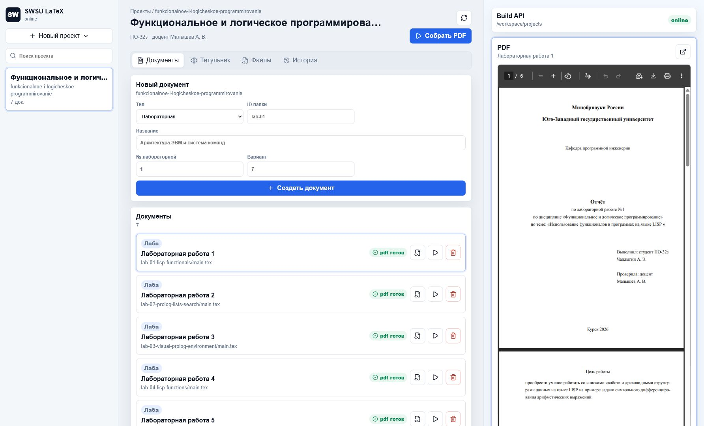
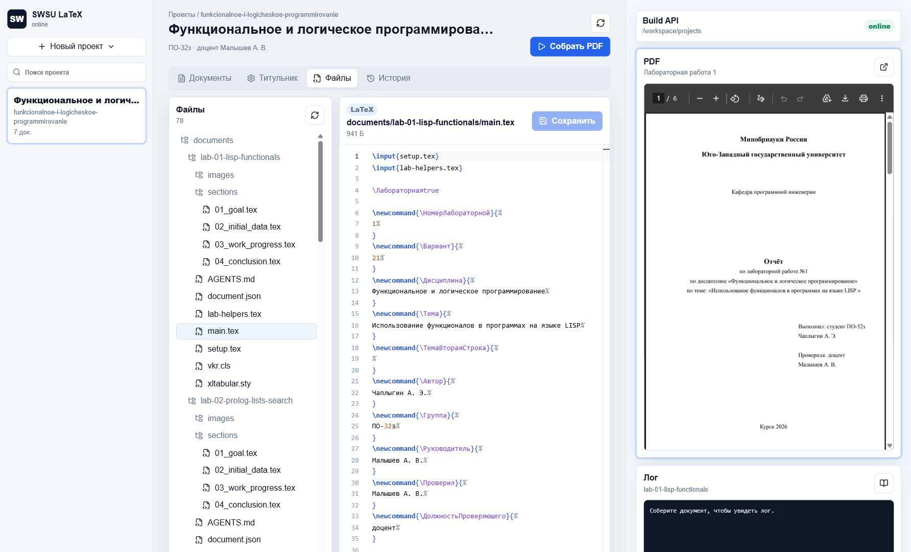
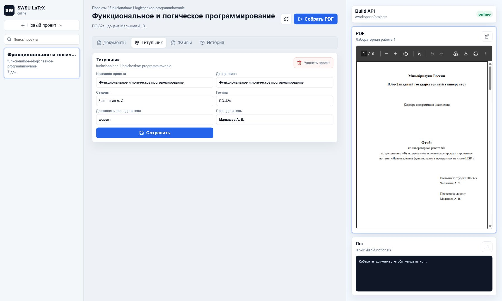
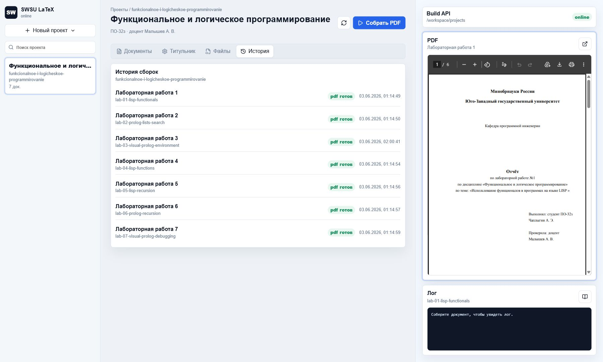

# Шаблон ВКР, курсовой, практики и лабораторных ЮЗГУ

В репозитории лежит исходный LaTeX-класс преподавателя и быстрый MVP
web-приложения для создания проектов, генерации документов и сборки PDF.
Оформление остается в `vkr.cls`, `setup.tex` и переменных документа.

## Интерфейс

### Документы



### Файлы



### Титульник



### История



## Быстрый запуск

Нужен Docker Desktop.

```bash
docker compose up --build
```

После запуска:

- UI: `http://localhost:3000`
- health endpoint: `http://localhost:3000/api/health`
- физические проекты: `workspace/projects`

На хосте TeX Live ставить не нужно. В контейнер ставятся TeX Live, `xelatex`
через пакет `texlive-xetex` и Microsoft Core Fonts с Times New Roman.
Основной текст собирается строго Times New Roman; если шрифт не найден, `vkr.cls`
останавливает сборку с ошибкой. Листинги кода используют Liberation Mono как
моноширинный шрифт для выравнивания строк.

## Что умеет MVP

- создавать проект как обычную папку;
- хранить в проекте настройки титульника: дисциплина, студент, группа, преподаватель и должность;
- создавать документы внутри проекта: `course`, `practice`, `lab`;
- удалять проекты и отдельные документы через UI и API;
- копировать в документ `main.tex`, секции, `vkr.cls`, `setup.tex`, `xltabular.sty`;
- собирать документ через `POST /api/build`;
- сохранять PDF в `build/main.pdf`, лог в `build/main.log`;
- показывать PDF и лог в браузере.

Лабораторные собираются в один проход `xelatex`, курсовая и практика -- в два.

## Структура

```text
app/                 Node.js API и статический UI
templates/course/    шаблон курсовой
templates/practice/  шаблон практики
templates/lab/       шаблон лабораторной
docs/                MVP-документация
docker/              настройки контейнера
workspace/projects/  создаваемые проекты, не коммитятся
```

## Workflow для ИИ-агента

1. Агент открывает физическую папку документа:
   `workspace/projects/<project-id>/documents/<document-id>`.
2. Если это лабораторная, агент читает `AGENTS.md` в папке документа.
3. Агент правит `.tex`-файлы и кладет изображения в `images/`.
4. Агент вызывает:

```http
POST /api/build
{
  "projectId": "<project-id>",
  "documentId": "<document-id>"
}
```

5. PDF появляется в `build/main.pdf`, лог сборки -- в `build/main.log`.

## Лабораторные работы

Шаблон лабораторной сделан по примерам отчетов:

```text
Титульный лист
Цель работы
Исходные данные
Ход работы
Вывод
```

В лабораторных не используется `\tableofcontents`. Разделы можно оформлять через
`\section*` или helper-команды шаблона: в текущем классе `\section` начинает новую
страницу, и для лабораторных это допустимо, если отчет делится на главы.
Подробные правила для агента лежат в `templates/lab/AGENTS.md` и копируются в
каждую созданную лабораторную.

## API

Основные endpoint'ы:

- `GET /api/projects`
- `POST /api/projects`
- `DELETE /api/projects/:projectId`
- `GET /api/projects/:projectId/documents`
- `POST /api/projects/:projectId/documents`
- `DELETE /api/projects/:projectId/documents/:documentId`
- `POST /api/build`
- `GET /api/projects/:projectId/documents/:documentId/pdf`
- `GET /api/projects/:projectId/documents/:documentId/log`

Подробнее: `docs/API_MVP.md` и `docs/RUN_MVP.md`.

## Ручная работа с исходным шаблоном

Старый режим через TexStudio тоже остается возможным.

Для работы необходимо установить:

- texlive - дистрибутив Latex.

- TexStudio - редактор для Windows.

В настройка TexStudio нужно выбрать компилятор xelatex.

Изображения делаются в формате:

- EPS для схем диаграмм, плакатов.

- PNG для скриншотов.

Для этого поместите файл изображения в папку /images и перетащите его курсором на нужную строку в TexStudio - откроется окно добавления новой иллюстрации. В этом окне можно сразу задать размер и подпись (в поле "Подпись -> длинная").

- Тире удобно вставлять с помощью двух дефисов -\-.  
Пример: человек -- это биосоциальное существо.

- TexStudio предоставляет возможность автоматического использования кавычек-елочек: Параметры -> Конфигурация -> Редактор -> замена двойных кавычек -> французские кавычки. (Пример: «ёлочки»).  
Если нужно несколько уровней кавычек в одном предложении, используйте такой вариант:  
<<Разработка web-сайта \textquotedbl Русатом -- Аддитивные технологии\textquotedbl\ на платформе 1С-Битрикс>>  
(пробел после команды \textquotedbl необходимо экранировать)  
Результат: «Разработка web-сайта "Русатом – Аддитивные технологии" на платформе 1С-Битрикс»
